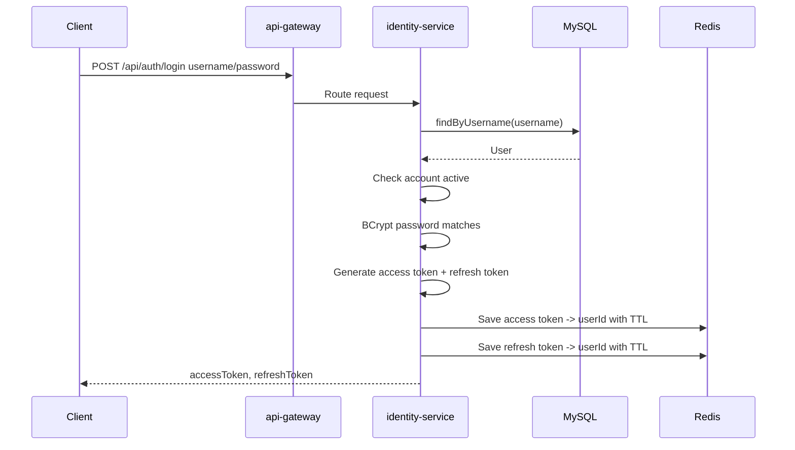
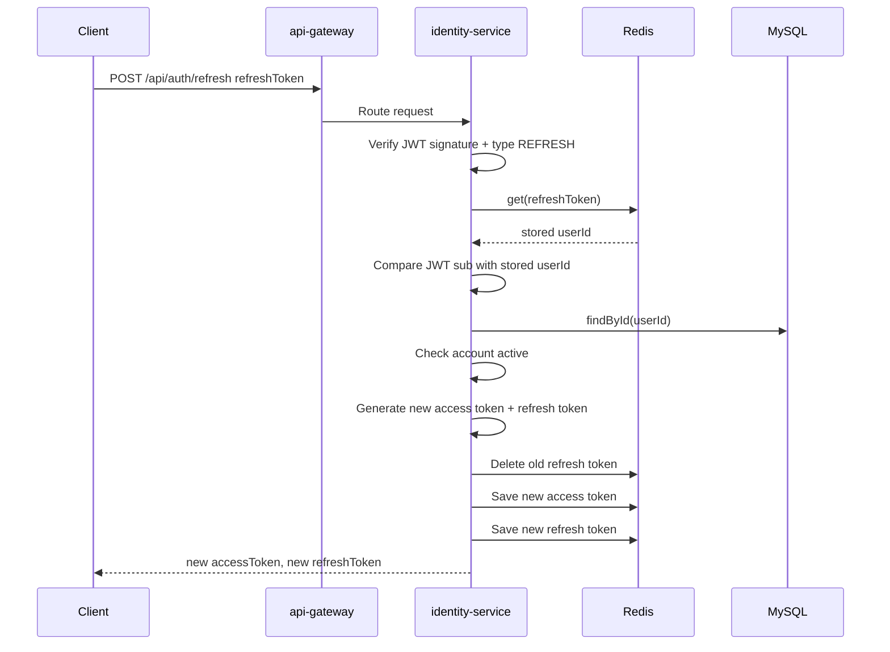
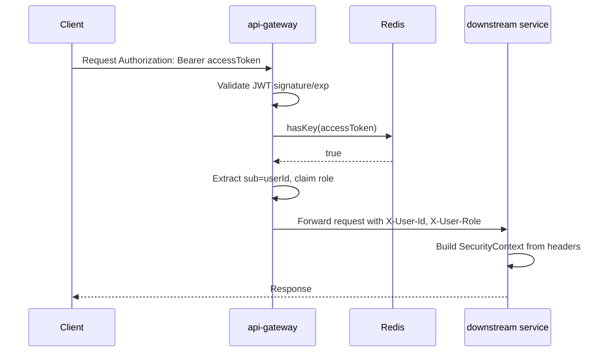

# Authentication Flow

Tài liệu này mô tả cách dự án đang xử lý authentication và cách context token/user được chia sẻ giữa các service.

## 1. Thành phần liên quan

| Thành phần | Vai trò trong auth |
| --- | --- |
| `identity-service` | Đăng ký, đăng nhập, refresh token, quản lý user/admin, phát hành JWT. |
| `api-gateway` | Điểm vào chính của request từ client, validate JWT, kiểm tra Redis, inject user context xuống downstream service. |
| `post-service` | Downstream service nhận user context qua header nội bộ, dựng `SecurityContext` từ header. |
| `redis` | Lưu access token và refresh token đang còn hiệu lực, đồng thời lưu blacklist token đã revoke. Redis được dùng như token allowlist/session store và deny-list. |
| `discovery-server` | Service discovery để gateway route tới `identity-service`, `post-service`. |

Code map:

| Luồng/chức năng | File chính |
| --- | --- |
| Login/register/refresh | `identity-service/src/main/java/com/example/identity/service/AuthService.java` |
| Tạo và validate JWT | `identity-service/src/main/java/com/example/identity/security/JwtProvider.java` |
| Lưu token Redis ở identity | `identity-service/src/main/java/com/example/identity/service/RedisService.java` |
| Gateway validate JWT/check Redis/inject header | `api-gateway/src/main/java/com/example/src/security/AuthenticationFilter.java` |
| Gateway security config/whitelist | `api-gateway/src/main/java/com/example/src/security/SecurityConfig.java` |
| Logout/revoke token | `api-gateway/src/main/java/com/example/src/controller/LogoutController.java` |
| Downstream đọc `X-User-*` ở identity | `identity-service/src/main/java/com/example/identity/security/HeaderAuthenticationFilter.java` |
| Downstream đọc `X-User-*` ở post | `post-service/src/main/java/com/example/post/security/HeaderAuthenticationFilter.java` |
| User profile dùng context header | `identity-service/src/main/java/com/example/identity/controller/UserController.java` |
| Admin authorization | `identity-service/src/main/java/com/example/identity/controller/AdminController.java` |

## 2. Token model hiện tại

Hệ thống dùng JWT ký bằng shared secret HS256.

Access token:

- Được tạo trong `identity-service` bởi `JwtProvider.generateToken(userId, role)`.
- `sub` của JWT là `userId`, không phải username.
- Có claim `role`.
- Có claim `type = ACCESS`.
- TTL lấy từ config `jwt.expiration`.
- Sau khi tạo, token được lưu vào Redis với key là chính token, value là `userId`.
- Khi logout, access token được xoá khỏi allowlist và ghi vào blacklist với TTL còn lại theo claim `exp`.

Refresh token:

- Được tạo trong `identity-service` bởi `JwtProvider.generateRefreshToken(userId)`.
- `sub` cũng là `userId`.
- Có claim `type = REFRESH`.
- TTL lấy từ config `jwt.refresh-expiration`.
- Sau khi tạo, token được lưu vào Redis với key là chính refresh token, value là `userId`.
- Khi refresh thành công, refresh token cũ bị xoá và hệ thống phát hành cặp access/refresh token mới.
- Khi logout có gửi refresh token, gateway chỉ revoke refresh token nếu token đó thuộc cùng user, sau đó xoá khỏi allowlist và ghi vào blacklist.

Redis hiện đang lưu token theo dạng:

```text
allowlist key   = <jwt-token-string>
allowlist value = <userId>
allowlist ttl   = access-token-expiration hoặc refresh-token-expiration

blacklist key   = blacklist:<jwt-token-string>
blacklist value = revoked
blacklist ttl   = thời gian còn lại của access token hoặc refresh-token-expiration
```

## 3. Login flow

Endpoint:

```http
POST /api/auth/login
```

Flow:



Các bước xử lý chính:

1. Client gửi username/password tới `/api/auth/login`.
2. Gateway cho phép route `/api/auth/login` đi qua không cần JWT.
3. `identity-service` tìm user theo username.
4. Kiểm tra trạng thái tài khoản:
   - `isEnable` phải là `true`.
   - `isLocked` phải là `false`.
   - `isDeleted` phải là `false`.
5. So khớp password bằng `PasswordEncoder`/BCrypt.
6. Tạo access token và refresh token.
7. Lưu cả hai token vào Redis với TTL tương ứng.
8. Trả về `AuthResponse(accessToken, refreshToken)`.

## 4. Register flow

Endpoint:

```http
POST /api/auth/register
```

Flow gần giống login, nhưng trước đó hệ thống tạo user mới:

1. Kiểm tra trùng username.
2. Kiểm tra trùng email.
3. Hash password bằng BCrypt.
4. Lưu user mới vào database.
5. Tạo access token và refresh token cho user mới.
6. Lưu token vào Redis.
7. Trả token về client.

User mặc định có:

```text
role = ROLE_USER
isEnable = true
isLocked = false
isDeleted = false
```

## 5. Refresh token flow

Endpoint:

```http
POST /api/auth/refresh
```

Request body:

```json
{
  "refreshToken": "<refresh-token>"
}
```

Flow:



Điểm quan trọng:

- Refresh token phải parse được bằng shared secret.
- Claim `type` phải là `REFRESH`.
- `sub` trong refresh token phải khớp với value đang lưu trong Redis.
- Refresh token cũ bị xoá sau khi cấp token mới.
- Access token cũ hiện không bị xoá trong refresh flow, nó vẫn còn hợp lệ tới khi hết TTL Redis/JWT.

## 6. Request authenticated qua gateway

Client gọi API cần đăng nhập bằng header:

```http
Authorization: Bearer <access-token>
```

Gateway xử lý theo 2 lớp:

1. Spring Security Resource Server validate JWT:
   - Kiểm tra signature bằng `JWT_SECRET`.
   - Kiểm tra hạn token theo claim `exp`.
   - Dựng `JwtAuthenticationToken`.
   - Map claim `role` thành authority.

2. `AuthenticationFilter` của gateway kiểm tra Redis:
   - Lấy raw token từ `JwtAuthenticationToken`.
   - Gọi `redisService.hasToken(token)`.
   - Nếu token còn trong Redis:
     - Lấy `userId` từ `jwt.getSubject()`.
     - Lấy `role` từ claim `role`.
     - Inject header nội bộ:

```http
X-User-Id: <userId>
X-User-Role: <role>
```

Sau đó gateway route request tới service đích.

Flow:



Nếu token không tồn tại trong Redis, gateway trả `401 Unauthorized` với lý do token đã bị invalidate.

## 7. Share context token giữa các service

Dự án không truyền nguyên JWT xuống downstream service để service tự parse lại. Cách share context hiện tại là:

```text
Client token
    -> api-gateway validate JWT + check Redis
    -> api-gateway extract user context
    -> api-gateway inject headers
    -> downstream service read headers
    -> downstream service build Spring SecurityContext
```

Header context chuẩn đang dùng:

| Header | Ý nghĩa | Nguồn |
| --- | --- | --- |
| `X-User-Id` | ID user hiện tại, lấy từ JWT subject | `api-gateway` |
| `X-User-Role` | Role user, lấy từ JWT claim `role` | `api-gateway` |

Ở downstream service:

- `identity-service` có `HeaderAuthenticationFilter`.
- `post-service` có `HeaderAuthenticationFilter`.
- Filter đọc `X-User-Id` và `X-User-Role`.
- Nếu đủ header, service tạo `UsernamePasswordAuthenticationToken`.
- Principal của authentication là `userId`.
- Authorities được dựng từ role.
- `SecurityContextHolder.getContext().setAuthentication(auth)` được set cho request hiện tại.

Ví dụ ở `identity-service`:

- `/api/users/me` đọc `X-User-Id` trực tiếp từ request header.
- `@PreAuthorize("isAuthenticated()")` dựa vào `SecurityContext` đã được dựng từ header.
- `/api/admin/**` dùng `@PreAuthorize("hasRole('ADMIN')")`.

Ví dụ ở `post-service`:

- Security config yêu cầu mọi request phải authenticated.
- Header filter dựng authentication từ `X-User-Id`, `X-User-Role`.
- Một số API vẫn nhận `userId` từ body/path, ví dụ tạo post dùng `post.userId`, feed dùng `/feed/{userId}`.

## 8. Authorization theo role

Role được lưu trong database dưới dạng mặc định:

```text
ROLE_USER
```

Admin API dùng:

```java
@PreAuthorize("hasRole('ADMIN')")
```

Lưu ý về mapping role:

- Gateway lấy claim `role` từ JWT và forward nguyên giá trị qua `X-User-Role`.
- `post-service` normalize role thành dạng có prefix `ROLE_` nếu chưa có.
- `identity-service` hiện tạo `SimpleGrantedAuthority(role.toUpperCase())`, tức nếu role trong DB là `ROLE_ADMIN` thì `hasRole('ADMIN')` hoạt động đúng.

## 9. Logout

Hiện tại endpoint:

```http
POST /api/auth/logout
```

được xử lý trực tiếp tại `api-gateway`. Client phải gửi access token trong header và có thể gửi refresh token của session hiện tại trong body:

```http
POST /api/auth/logout
Authorization: Bearer <access-token>
Content-Type: application/json

{
  "refreshToken": "<refresh-token>"
}
```

Body là tùy chọn. Flow xử lý:

1. Spring Security validate chữ ký và thời hạn của access token.
2. Gateway lấy raw access token từ authenticated `Jwt`.
3. Gateway xoá access token khỏi allowlist Redis.
4. Gateway ghi access token vào blacklist Redis với TTL bằng thời gian còn lại tới claim `exp`.
5. Nếu request có refresh token, gateway đọc owner của token từ Redis.
6. Gateway chỉ revoke refresh token khi owner trùng với `sub` của access token, tránh xoá session của user khác.
7. Với refresh token hợp lệ của cùng user, gateway xoá refresh token khỏi allowlist và ghi vào blacklist.
8. Endpoint trả:

```text
logout success
```

Sau khi access token bị logout, `AuthenticationFilter` check blacklist trước, sau đó mới check allowlist. Nếu token đó được dùng lại, gateway trả `401 Token invalidated`.

Với refresh token, `identity-service` cũng check blacklist trong `/api/auth/refresh`. Nếu client không gửi refresh token khi logout, access token vẫn bị revoke nhưng refresh token còn hiệu lực cho tới khi hết TTL hoặc được rotate.

## 10. Route và trust boundary

Trust boundary hiện tại:

```text
Client
  -> chỉ được gọi qua api-gateway
api-gateway
  -> validate token
  -> inject X-User-* headers
downstream services
  -> tin X-User-* headers là do gateway set
```

Điều này nghĩa là downstream services nên được đặt trong network nội bộ, không expose trực tiếp ra bên ngoài. Nếu client gọi thẳng `post-service` hoặc `identity-service` và tự gắn `X-User-Id`, `X-User-Role`, service có thể tin nhầm header giả mạo.

Khuyến nghị vận hành:

- Chỉ expose `api-gateway` ra public.
- Không expose port HTTP của downstream services ra internet.
- Nếu bắt buộc expose, downstream service phải tự validate JWT hoặc có cơ chế xác thực service-to-service.

## 11. Hiện trạng cần chú ý

1. Refresh flow xoá refresh token cũ nhưng không xoá access token cũ.
2. Context đã được truyền bằng `X-User-Id`, `X-User-Role`, nhưng một số business API vẫn lấy `userId` từ path/body thay vì lấy user hiện tại từ `SecurityContext`.
3. Downstream service tin header nội bộ, nên kiến trúc phụ thuộc vào việc chỉ cho traffic đi qua gateway.
4. Gateway whitelist hiện có cả `/api/posts/**` và `/api/media/**`. Nếu request không có JWT, gateway có thể cho đi qua, nhưng `post-service` vẫn yêu cầu authenticated nên request thiếu `X-User-*` sẽ bị chặn ở service.
5. Token Redis key đang là toàn bộ JWT string. Cách này đơn giản nhưng khó quản lý nhiều session theo user, logout theo user, hoặc revoke toàn bộ token của user.
6. Logout hiện chỉ xử lý một session và cần client gửi refresh token để revoke cả cặp token; chưa hỗ trợ logout toàn bộ thiết bị.

## 12. Gợi ý cải thiện

Ưu tiên gần:

1. Thiết kế lưu refresh token theo session/user để gateway tự tìm được refresh token mà không phụ thuộc client gửi lại khi logout.
2. Chuẩn hoá downstream service lấy user hiện tại từ `SecurityContext` thay vì tin `userId` do client gửi trong body/path.
3. Xoá các public whitelist không cần thiết ở gateway, hoặc phân biệt rõ endpoint public/private.

Ưu tiên kiến trúc:

1. Dùng session id/jti claim trong JWT, lưu Redis theo `jti -> session`.
2. Lưu danh sách session theo user để hỗ trợ logout all devices.
3. Thêm internal gateway signature hoặc mTLS/service mesh nếu downstream service có nguy cơ bị gọi trực tiếp.
4. Thống nhất authority format toàn hệ thống, ví dụ luôn dùng `ROLE_USER`, `ROLE_ADMIN`.

## 13. Tóm tắt ngắn

Authentication hiện tại được xử lý tập trung ở `identity-service` và `api-gateway`.

- `identity-service` phát hành access/refresh token và lưu token vào Redis.
- `api-gateway` validate JWT, kiểm tra token không nằm trong blacklist và còn trong Redis allowlist, rồi forward `X-User-Id` và `X-User-Role`.
- Các service phía sau dựng `SecurityContext` từ hai header này.
- Redis đóng vai trò allowlist và blacklist để revoke/invalidate token; logout xoá access token khỏi allowlist, ghi access token vào blacklist, và làm tương tự với refresh token cùng user khi client cung cấp token này.
